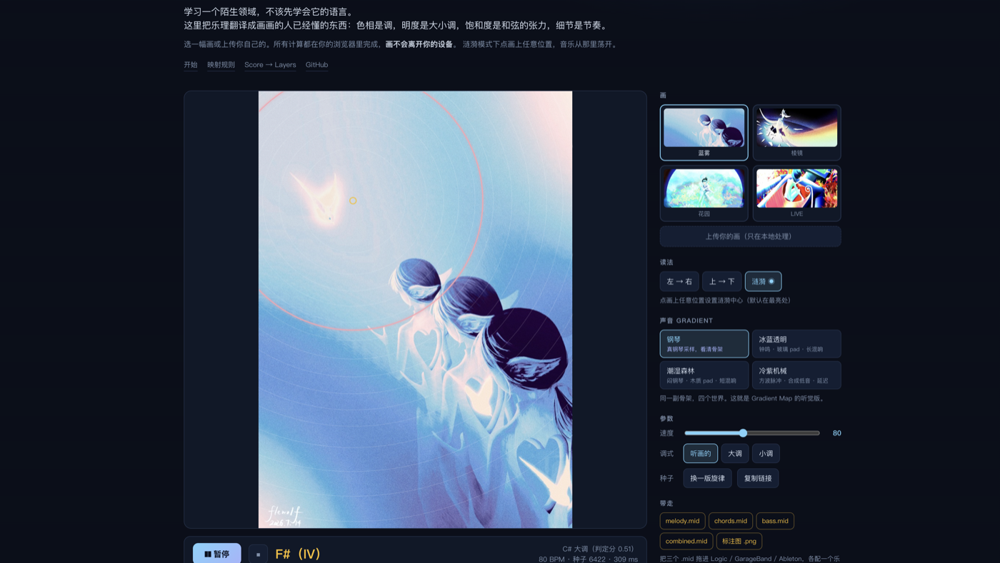
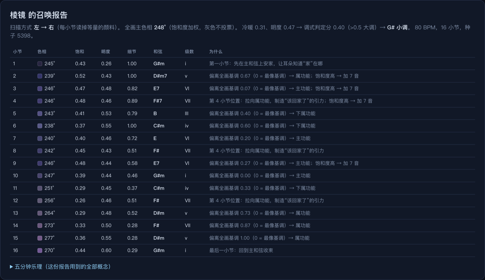

# Gradient Lab

**把一幅画，读成一段音乐。** 试玩：<https://flewolfxy.github.io/gradient-lab/>

> 学习一个陌生领域，不该先学会它的语言。
> 这个项目把乐理翻译成画画的人已经懂的东西：色相是调，明度是大小调，饱和度是和弦的张力，细节是节奏。

[](https://flewolfxy.github.io/gradient-lab/)

## 它是什么

一个给"会画画、不会乐理"的人做的创作入口。两个方向，同一个论点：

| 模块 | 方向 | 状态 |
|---|---|---|
| **Paint → Score**（`docs/`） | 一幅画 → 一段能听、能下载 MIDI、能逐小节解释的音乐 | 纯前端，公开可玩 |
| **Score → Layers**（`audio-xray/`） | 一段音频 → 波形 / CQT / Mel / 十二音级色带 / 三段响度 / 和弦候选 / 段落 / 自相似矩阵的"图层面板" | Python 本地工具 |

`paint-to-midi/` 是 Paint → Score 的 Python 原型（CLI + Flask），前端版从它移植而来，两者算法一致。

## Paint → Score 能做什么

- **三种读法**：左→右（画 = 卷轴）、上→下（画 = 瀑布）、涟漪（点画上任意一点，音乐从那里荡开，画 = 水面）。三种读法在算法里是同一个抽象：给每个像素一个"到达时间"的标量场，小节 = 场的等像素量分位带。
- **声音 Gradient**：同一副 MIDI 骨架，一键切换 钢琴 / 冰蓝透明 / 潮湿森林 / 冷紫机械 四个世界。这是 Procreate Gradient Map 工作流的听觉版。
- **可解释**：每一小节都有一行"为什么"——这块颜色的色相偏离全画基调多少、饱和度多高、于是变成了哪个和弦、属于哪种功能。报告末尾附五分钟乐理，只讲用到的概念。
- **带走**：melody / chords / bass / combined 四个 `.mid`，拖进 Logic、GarageBand、Ableton 各配一个乐器；标注图 `.png`；一条能复现当前画、读法、焦点、音色、种子的链接。
- **隐私**：所有计算在浏览器里完成，上传的画不会离开你的设备。没有服务器。



## 映射规则

不是像素 → 音符的花活，是画面 → **音乐决策**的翻译。每一条都能用画画的人的直觉解释。

| 画面 | 音乐 | 为什么 |
|---|---|---|
| 全画主色相（饱和度加权，灰色不投票）走五度圈 | 主音 / 调 | 相邻色相 → 相邻的调；色环和五度圈都是圆 |
| 明度 + 冷暖 | 大调 / 小调 | 亮而暖的画很少是小调 |
| 扫描方向 | 时间轴 | 画 = 卷轴 / 瀑布 / 水面 |
| 每小节区域偏离全画基调的程度（排名归一化） | 和弦功能：主 → 下属 → 属 | 像基调 = 在家；偏得远 = 想回家 |
| 饱和度 | 和弦张力：三和弦 → 加 7 → 加 9 | 颜色越浓，声音越湿润复杂 |
| 明度 | 音区高低 | 亮 = 高 |
| 区域内最亮处的位置 | 旋律轮廓 | 旋律住在画面最亮处 |
| 边缘 / 细节密度 | 节奏密度（近黑 = 休止） | 笔触密的地方音也密 |

硬规则保底：第 1 与最后 1 小节锁主和弦；每 4 小节拉向属和弦（终止式）；所有和弦在调内；旋律强拍吸附和弦音；相邻音跨度不超过五度。所以**保证协和，丑也丑得在调上**。随机性只留给力度与微小的时值抖动——同一幅画、同一个种子，永远召唤出同一首曲子。



## 设计原则

1. **翻译，不是替代。** 工具给素胚，审美归人。产物是 MIDI 而不是成品音频，就是为了让人在 DAW 里继续做决定。
2. **每个决定都可解释。** 没有黑盒。一个初学者应该能从报告里反推出规则，然后开始不同意它。
3. **规则先保底，再谈表达。** 先用硬规则保证"在调上"，再让画面驱动变化。听感差的第一版比听感随机的第一版更可迭代。
4. **用户的母语优先。** 界面里的词是色相、明度、饱和度、笔触，不是调式、音级、和声功能——后者放在"为什么"那一栏里，等你好奇了再看。

## 已知边界与下一步

- **双色调对峙。** 当一幅画有两个势均力敌的色彩阵营（比如火焰与蓝色机器人），饱和度加权的平均色相会落在两者之间一个并不存在的颜色上。下一版检测双峰色相分布：主色定调，副色变成借用和弦。
- **画 → 曲 → 图谱闭环。** 把召唤出的曲子喂回 Score → Layers，并排展示画的构图与曲子的自相似矩阵：涟漪的同心结构应该在 SSM 上重现。
- **分享卡片。** 画 + 和弦标注 + 30 秒音频导出成视频。

## 本地运行

Paint → Score 是静态站点，任何静态服务器即可：

```bash
cd docs && python3 -m http.server 8090
```

Score → Layers（需要 Python 3.10+，librosa）：

```bash
cd audio-xray
python3 -m venv .venv && ./.venv/bin/pip install -r requirements.txt
./.venv/bin/python app.py     # http://127.0.0.1:5000
```

Python 原型 CLI：

```bash
cd paint-to-midi
python3 -m venv .venv && ./.venv/bin/pip install -r requirements.txt
./.venv/bin/python paint_to_midi.py 你的画.png --scan ripple --focus 0.62,0.40
```

## 技术

前端：原生 ES modules，Canvas，[Tone.js](https://tonejs.github.io/)（采样与合成），自写的 SMF 写入器。无构建步骤，无框架。
分析：HSV 统计、梯度边缘、按扫描场排序 + 前缀和，任意分位带统计 O(log n)，一幅画 ~100–400 ms 出结果。
钢琴采样：[Salamander Grand Piano](https://github.com/sfzinstruments/SalamanderGrandPiano)（CC-BY），由 Tone.js 托管。
Python 侧：numpy、Pillow、mido、librosa、Flask。

画作均为作者本人作品。
