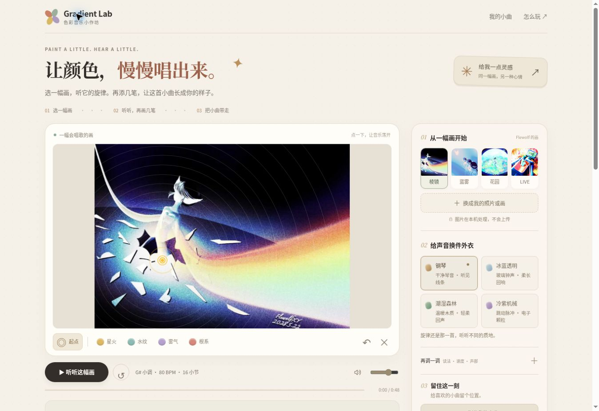
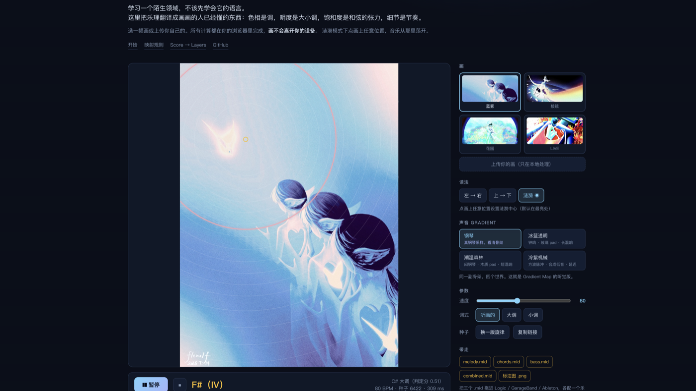
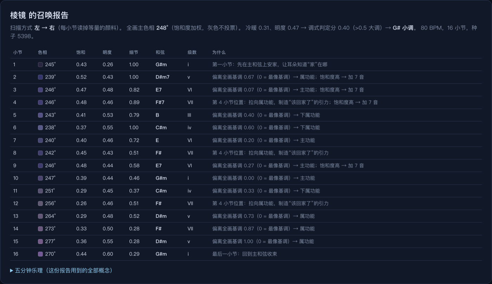
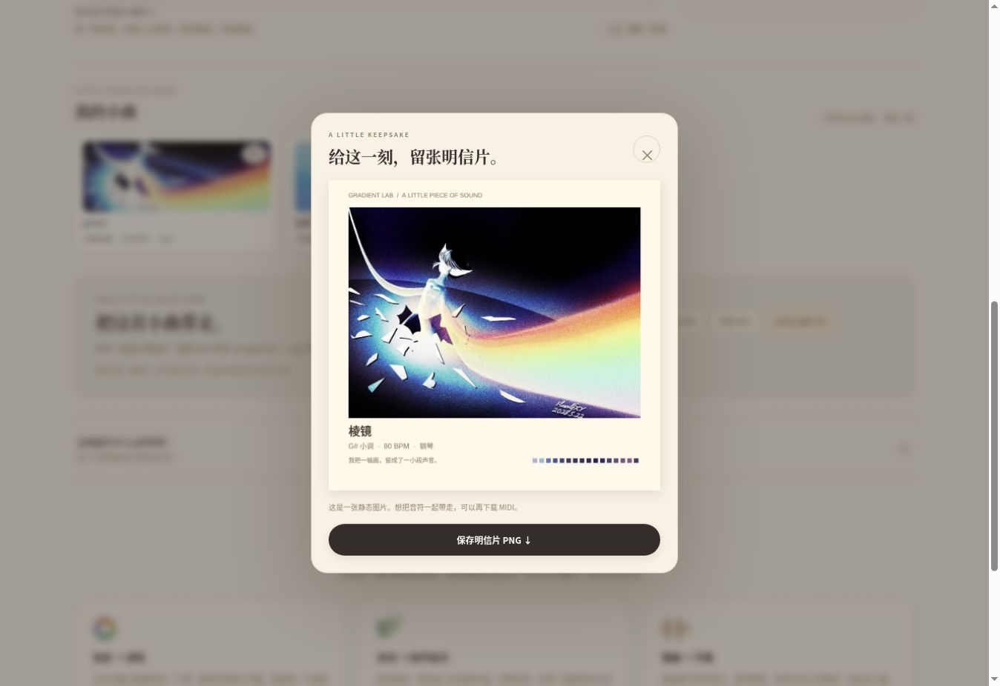
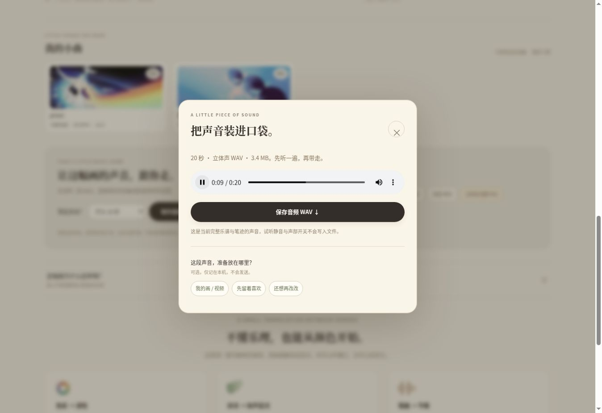

# Gradient Lab

**把一幅画，读成一段音乐。** 试玩：<https://flewolfxy.github.io/gradient-lab/>

> 学习一个陌生领域，不该先学会它的语言。
> 这个项目把乐理翻译成画画的人已经懂的东西：色相是调，明度是大小调，饱和度是和弦的张力，细节是节奏。

[](https://flewolfxy.github.io/gradient-lab/)

## 它是什么

一个给"会画画、不会乐理"的人做的创作入口。两个方向，同一个论点：

| 模块 | 方向 | 状态 |
|---|---|---|
| **Paint → Score**（`docs/`） | 一幅画 → 可解释的音乐，再用自然语言提出受控修改 | 静态前端 + 独立 AI 服务，公开可玩 |
| **Score → Layers**（`audio-xray/`） | 一段音频 → 波形 / CQT / Mel / 十二音级色带 / 三段响度 / 和弦候选 / 段落 / 自相似矩阵的"图层面板" | Python 本地工具 |

`paint-to-midi/` 是 Paint → Score 的 Python 原型（CLI + Flask），前端版从它移植而来；后续前端的图像边界处理、交互与导出验证独立演进。

## Paint → Score 能做什么

- **三种读法**：左→右（画 = 卷轴）、上→下（画 = 瀑布）、涟漪（点画上任意一点，音乐从那里荡开，画 = 水面）。三种读法在算法里是同一个抽象：给每个像素一个"到达时间"的标量场，小节 = 场的等像素量分位带。
- **手绘点色层**：用「起点」选择涟漪中心，切换画笔后直接在原画上点或划。星火 / 水纹 / 雾气 / 根系是四种颜色，也是四件乐器；横向或涟漪距离决定时间，纵向决定调内音高。笔迹会进入循环，播放到时再次发光。
- **声音 Gradient**：同一副 MIDI 骨架，一键切换 钢琴 / 冰蓝透明 / 潮湿森林 / 冷紫机械 四个世界。这是 Procreate Gradient Map 工作流的听觉版。
- **可解释**：每一小节都有一行"为什么"——这块颜色的色相偏离全画基调多少、饱和度多高、于是变成了哪个和弦、属于哪种功能。报告末尾附五分钟乐理，只讲用到的概念。
- **带走**：melody / chords / bass / painted / combined 五个 `.mid`，拖进 Logic、GarageBand、Ableton 各配一个乐器；含点色笔迹的标注图 `.png`；一条能复现当前画、读法、焦点、音色、种子的链接。
- **隐私**：图片分析、编辑执行和声音导出在浏览器本机完成。主动提交 AI 修改时，仅将文字与范围、速度等必要参数发送到独立服务与 DeepSeek；图片和音频不会上传。



## 映射规则

不是像素 → 音符的花活，是画面 → **音乐决策**的翻译。每一条都能用画画的人的直觉解释。

| 画面 | 音乐 | 为什么 |
|---|---|---|
| 全画主色相（饱和度加权，灰色不投票）走五度圈 | 主音 / 调 | 相邻色相 → 相邻的调；色环和五度圈都是圆 |
| 明度 + 冷暖 | 大调 / 小调 | 亮而暖的画很少是小调 |
| 扫描方向 | 时间轴 | 画 = 卷轴 / 瀑布 / 水面 |
| 每小节区域偏离全画基调的程度（排名归一化） | 和弦功能：主 → 下属 → 属 | 像基调 = 在家；偏得远 = 想回家 |
| 饱和度 | 和弦张力：三和弦 → 加 7 → 加 9 | 颜色越浓，声音越湿润复杂 |
| 明度 | 音区高低 | 亮 = 高 |
| 区域内最亮处的位置 | 旋律轮廓 | 旋律住在画面最亮处 |
| 边缘 / 细节密度 | 节奏密度（近黑 = 休止） | 笔触密的地方音也密 |

硬规则保底：第 1 与最后 1 小节锁主和弦；每 4 小节拉向属和弦（终止式）；三和弦骨架在调内；旋律强拍吸附和弦音；相邻音跨度不超过五度。以调内三和弦为骨架，七音与九音增加和声色彩。随机性只留给力度与微小的时值抖动——同一幅画、同一个种子，永远召唤出同一首曲子。



## 设计原则

1. **翻译，不是替代。** 工具给素胚，审美归人。MIDI 供人在 DAW 中继续创作，WAV 让不使用 DAW 的人也能直接带走声音。
2. **让修改可检查。** 图像映射有逐小节解释；AI 将日常语言转成有限动作，先展示实际变化，再通过试听和撤销保留人的决定权。
3. **规则先保底，再谈表达。** 先用硬规则保证"在调上"，再让画面驱动变化。听感差的第一版比听感随机的第一版更可迭代。
4. **用户的母语优先。** 界面里的词是色相、明度、饱和度、笔触，不是调式、音级、和声功能——后者放在"为什么"那一栏里，等你好奇了再看。



## 已知边界与下一步

- **双色调对峙。** 当一幅画有两个势均力敌的色彩阵营（比如火焰与蓝色机器人），饱和度加权的平均色相会落在两者之间一个并不存在的颜色上。下一版检测双峰色相分布：主色定调，副色变成借用和弦。
- **画 → 曲 → 图谱闭环。** 把召唤出的曲子喂回 Score → Layers，并排展示画的构图与曲子的自相似矩阵：涟漪的同心结构应该在 SSM 上重现。
- **有声分享卡片。** 已支持静态音乐明信片预览与 PNG 导出；画 + 和弦标注 + 30 秒音频的视频仍未实现。

## 本地运行

Paint → Score 是静态站点，任何静态服务器即可：

```bash
cd docs && python3 -m http.server 8090
```

Score → Layers（需要 Python 3.10+，librosa）：

```bash
cd audio-xray
python3 -m venv .venv && ./.venv/bin/pip install -r requirements.txt
./.venv/bin/python app.py     # http://127.0.0.1:5000
```

Python 原型 CLI：

```bash
cd paint-to-midi
python3 -m venv .venv && ./.venv/bin/pip install -r requirements.txt
./.venv/bin/python paint_to_midi.py 你的画.png --scan ripple --focus 0.62,0.40
```

## 技术

前端：原生 ES modules，Canvas，[Tone.js](https://tonejs.github.io/)（采样与合成），自写的 SMF 写入器。无构建步骤，无框架。
分析：HSV 统计、梯度边缘、按扫描场排序 + 前缀和，任意分位带统计 O(log n)，一幅画 ~100–400 ms 出结果。
钢琴采样：[Salamander Grand Piano](https://github.com/sfzinstruments/SalamanderGrandPiano)（CC BY 3.0），精选采样随站点提供并保留署名。
Python 侧：numpy、Pillow、mido、librosa、Flask。

画作均为作者本人作品。


## Warm Studio 更新（2026-10）

- 奶油纸面工作台，先听再探索；扫描、调式和声部控制渐进展开。
- 播放中的当前小节解释、音量与试听声部开关、键盘播放和减少动态效果支持。
- 三个可撤回的灵感配方；保留原图和笔迹。
- 本机小曲收藏（最多 8 首，上传图压缩后仅在本机保存）；音乐明信片预览与 PNG；可继续编辑的分轨与合并 MIDI。
- 内置画作分享链接包含参数和手绘笔迹。上传图不会被传到服务器，不能通过链接分享，请使用本机收藏或导出。
- Tone.js 与精简钢琴采样随站点提供，避免第三方 CDN 阻断。采样失败时使用合成琴音并提示。署名见 `docs/audio/salamander/ATTRIBUTION.md`。
- 声部开关只影响试听，MIDI 导出保留完整音轨。

静态站仍没有构建步骤。纯逻辑回归检查：

```bash
node --test --test-isolation=none tests/*.test.mjs
```

交互灵感参考：Chrome Music Lab 的 [Kandinsky](https://musiclab.chromeexperiments.com/Kandinsky/)、[Paint with Music](https://magenta.withgoogle.com/paint-with-music)、[Blob Opera](https://artsandculture.google.com/experiment/blob-opera/AAHWrq360NcGbw)。暖纸色与轻量上手流程参考作者自己的 [孵豆公开版](https://hatchbeads.com/)。代码与素材均保留各自署名。


## 可控共创更新（2026-10-03）

- **局部编辑**：整首、前半段、后半段、结尾；默认锁定旋律音符，手绘声部保留。
- **真实 DeepSeek 提案**：自然语言经服务端结构化规划与范围/旋律约束校验，再由浏览器执行固定动作。快捷按钮仍是本机规则。每次先 A/B 试听，再接受或取消；可撤回。
- **带走声音**：20 秒、30 秒或完整一遍的立体声 WAV，保留当前音色、效果与手绘声部，提供文件内播放预览。
- **可重现**：局部编辑随分享链接和本机收藏保存，MIDI/WAV 都来自当前修改后的乐谱。
- **可观察**：仅当前标签页的操作记录，可手动导出；不存图片、文件名、输入原文，不自动上报。点击下载、选择用途不等于已真实使用。
- **服务边界**：DeepSeek key 仅存在模型服务的秘密配置中；当前试验服务每日最多 40 次模型请求，单来源每日 20 次、每分钟 3 次。限额后本机编辑、收藏与导出仍可使用。

[需求假设与模拟任务](research/2026-10-03-user-hypotheses.md)来自公开研究与产品推演，不是用户访谈。[真实模型合成用例检查](research/2026-10-03-live-model-eval.json)记录 12 条合成请求的一次运行，不是用户满意度或线上业务效果。构建时通过 56 项自动化回归；后续改动应重新运行测试。

服务端规划器源码在 `server/planner.js`；`docs/model-config.js` 只有公开服务地址。模型负责提出方案，`docs/creative-edits.js` 负责有限动作、边界校验与执行。新增不支持的动作会要求澄清或拒绝，不会执行模型生成的代码。



